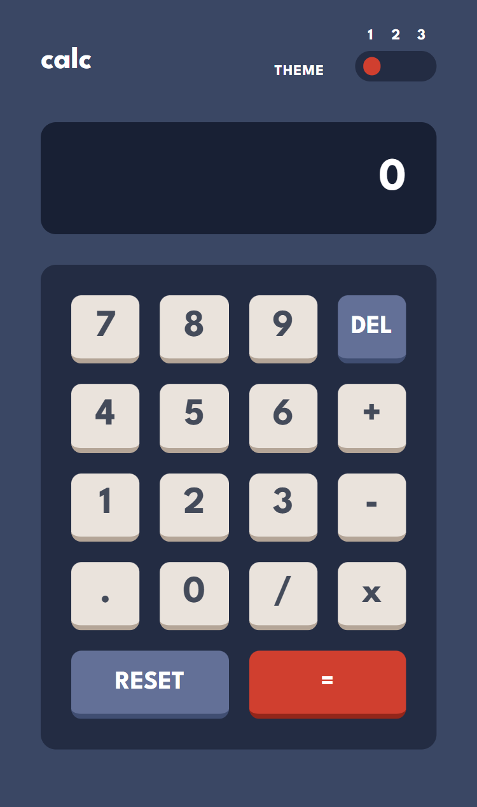
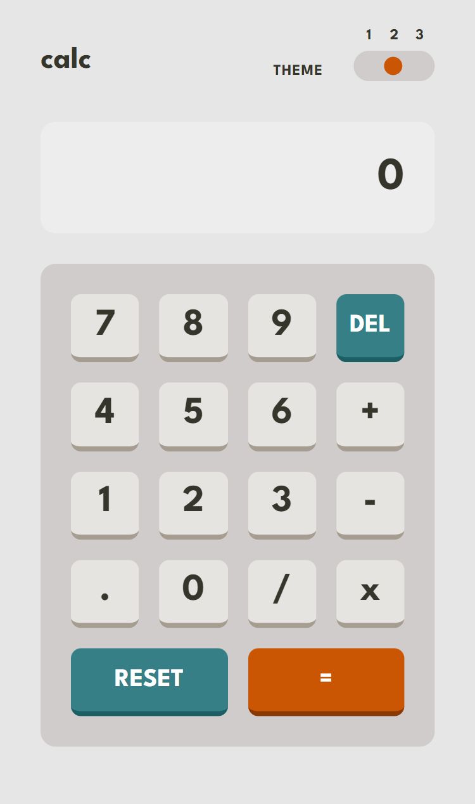
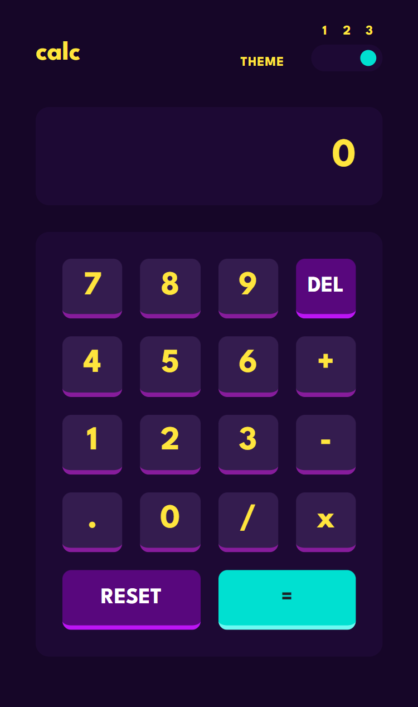

# Frontend Mentor - Calculator app solution

This is a solution to the [Calculator app challenge on Frontend Mentor](https://www.frontendmentor.io/challenges/calculator-app-9lteq5N29). Frontend Mentor challenges help you improve your coding skills by building realistic projects. 

## Table of contents

- [Overview](#overview)
  - [The challenge](#the-challenge)
  - [Screenshot](#screenshot)
- [My process](#my-process)
  - [Built with](#built-with)
  - [What I learned](#what-i-learned)
  - [Useful resources](#useful-resources)
- [Author](#author)

## Overview

### The challenge

Users should be able to:

- See the size of the elements adjust based on their device's screen size
- Perform mathmatical operations like addition, subtraction, multiplication, and division
- Adjust the color theme based on their preference
- **Bonus**: Have their initial theme preference checked using `prefers-color-scheme` and have any additional changes saved in the browser

### Screenshot

## My process

### Built with

- [React](https://reactjs.org/) - JS library
- [TypeScript](https://www.typescriptlang.org/) - JS Superset
- [Tailwind CSS](https://tailwindcss.com/) - Styles

### What I learned

I learned a lot about how to create and managed multiple color themes in a web app using Tailwind CSS and extending the theme with CSS color variables. I also gained many useful techniques to manipulating and formatting strings. Finally, I became much more familiar with switch statements, keypress events, and error handling for the calculator display.

### Useful resources

- [Creating custom themes with Tailwind CSS](https://blog.logrocket.com/creating-custom-themes-tailwind-css/) - This helped me variable color classes when more than light and dark color themes are needed.
- [3 Ways To Add Comma To Numbers In Javascript (Thousands Separator)](https://code-boxx.com/add-comma-to-numbers-javascript/) - I used Method 3 as a baseline for my number formatting, but made a few tweaks to negative numbers and to remove and replace operators to allow for proper formatting.
- [Styling Radio Buttons with CSS (59 Custom Examples)](https://www.sliderrevolution.com/resources/styling-radio-buttons/) - The Animated Switch for Radio Button example was very helpful in figuring out how to turn multiple radio buttons into a single toggle switch.

## Author

- Website - [Justin Fowler Art](https://www.justinfowlerart.com)